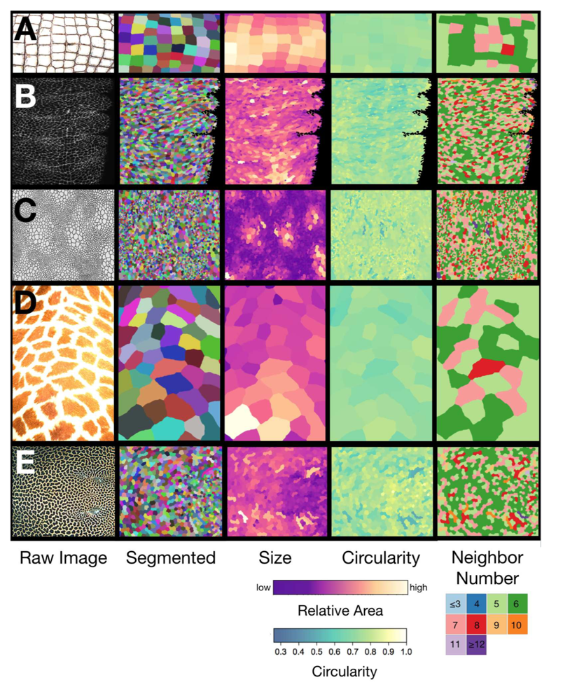
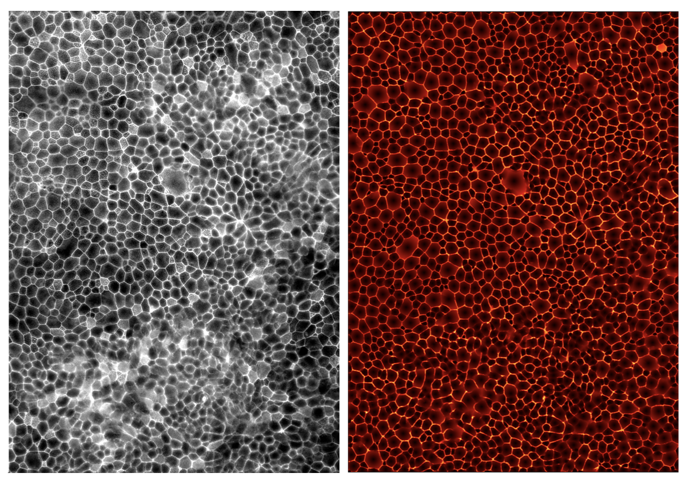
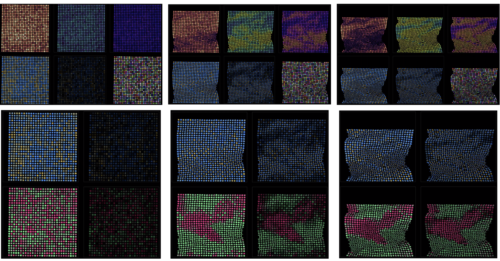

# Fast-Marching-Image-Segmentation
Image segmentation method based on the fast marching method

## Code Written By Jordan Hoffmann
===============================================================
Feel free to email me with any questions (log in to GitHub to see email). 


Contents
===============================================================
All code used in the manuscript is available upon request. Here we provide
basic code that segments and runs out routine on an example wing.

Segment Wing Image 
	-Code and example wing used to segment wings in the manuscript.
Optimization
	-Code used to perform area-weighted circularity optimization


Code Requirements
===============================================================
All Python Code Python v 2.7
Anaconda makes installing all packages easy.
All Mathematica code works in Mathematica 10 and 11
Dependencies:
```
numy, scipy, Pillow, matplotlib
scikit-fmm [https://github.com/scikit-fmm/scikit-fmm]
scikit-image [http://scikit-image.org/]
```
Installation of dependencies on clean Ubuntu build
```
pip install numpy
pip install scipy
pip install Pillow
pip install matplotlib
pip install scikit-fmm
pip install scikit-image
```
Code can be easily parallelized to run on many wing images simultaneously using
```
mpi4py
glob
```


Running the code
===============================================================
Once dependencies installed:
```
cd Segment_Wing_Image
python generate_seeds_and_velocity.py
python segment.py
python mask_image.py
cd ..
```
Open _Mathematica_ Notebook for Polygonization and Optimization routines.

Examples
===============================================================

# Segmentation of Biological Images
Here is an example of a wide range of segmented biological images.

These are taken from the SI of Hoffmann and Donoughe, et al, PNAS 2018.
For another project, I was able to help a group segment the following image:

# Segmentation of Compressed Materials
Katia Bertoldi's group was looking at the properties of compressed structures that were initially composed of a grid of disc-shaped holes. During compression, the holes gained an orientation, either parallel or perpendicular to the axis of compression. 
However, studying the geometric properties of the holes during the compression was not a trivial segmentation task. 
As the material compressed, the holes would get smaller, at some point becoming nearly invisible. 
Additionally, the center of the holes would come in contact before either side, resulting in shapes that appeared to be two objects rather than one. The lighting and the material made it increasingly difficult to use off-the-shelf segmentation tools. 
However, by modifying my tool, I was able to create extremely accurate segmentations for nearly the entire duration of the video.
By initializing each hole with 4 different seeds, I performed a level set segmentation up until some maximum time, $T$. Then, using a lookup table, I reassambled the space belonging to each hole.
Then, for hole $i$, I assemble a list of all coordinates belonging to that hole, $\vec{x}_i = ((x_1,y_1),(x_2,y_2),...,(x_n,y_n))$. Then, for this list, I perform K-means clustering with 4 seeds. This method allows me to track an object that splits while still calling it a single object.

Here is a video of the process [click on image]:

[](https://www.youtube.com/watch?v=ptUvsK35qg8)

